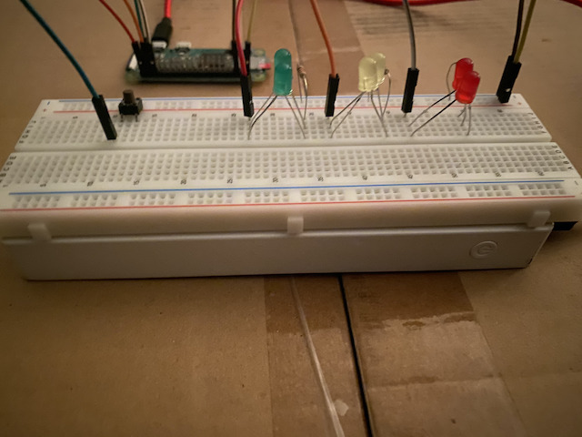
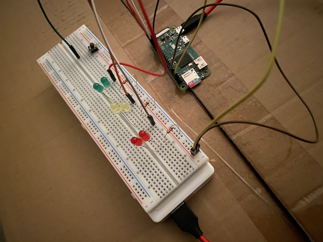
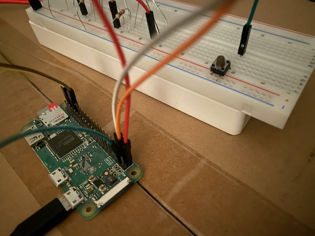

# on-air
Tired of people walking into your room while you're in a video call? `on-air` to the rescue!

## What
My small little program to control 3 pairs of leds (green, yellow and red) and a button connected to a Raspberry Pi Zero W. With the Raspberry being powered by a power bank, it makes for a wireless (as a whole) set that can be placed anywhere and controlled either with the physical button on the breadboard or with the API (provided you connect your Raspberry to the network). It will probably only be useful to me but `¯\_(ツ)_/¯`

## Gotcha, but... why?
Well, the 3 LEDs can be used for anything but what I do is I place the device outside the closed door of the room where I'm working. If I'm coming into the room to make a video call, I'll press the button to turn the lights red and everyone will know I'm busy when they walk by. When the call ends, I will either walk out of the room and press the button to set the light green or, if I'm staying in the room, I'll make a request to the API to do the same. That way, if someone walks by and needs to talk to me, they know I'm available even though my door is closed.

IT BASICALLY ACTS LIKE THOSE `ON AIR` SIGNS THEY HAVE IN THE RADIO STUDIOS

## Ohh I see... wait, what does your hardware setup look like?
</img> </img> </img> </img> 

## So how do you set up the software?
1. Compile the binary. When targeting the Raspberry Pi Zero W, that looks like:
```sh
GOOS=linux GOARCH=arm GOARM=5 go build
```
2. Place the `on-air` binary in the Raspberry's `/usr/local/bin/` folder.
3. Copy the systemd unit file to `/etc/systemd/system/`.
4. Run `systemctl status on-air` and it should show up.
4. Run `sudo systemctl daemon-reload && sudo systemctl enable on-air && sudo systemctl start on-air`. Your systemd unit is ready and `on-air` will be started at boot automatically!

## I got everything working now. How do I use it?
So this section is more like a reminder for my future self than anything else, really, no one will ever get here hah. Usage:

API:
- GET request to know which light is on at the moment
- PATCH request to change which light is on

BUTTON:
- Click to cycle to the next light (off -> green -> yellow -> red -> off -> ...)
- Press for 5 seconds, all lights will turn on and the Raspberry will shut down. To turn it back on, just press the ON button on the power bank. The Raspberry turns on when it gets power!

## Gosh, this code is terrible
Hah, welcome to my world.
